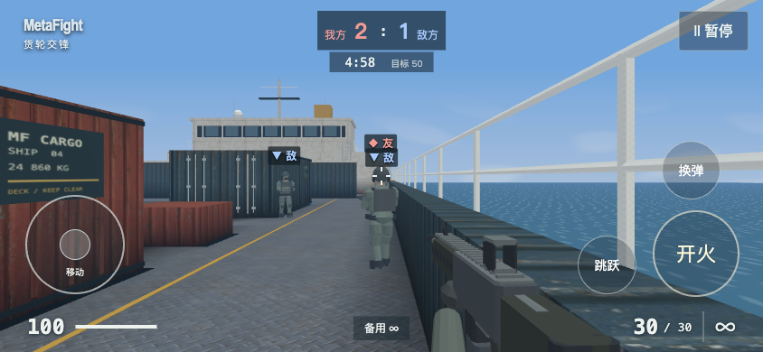
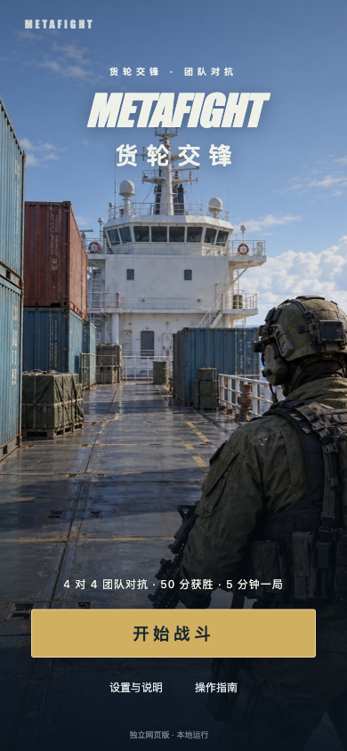

# MetaFight · 货轮交锋

**把一局 4v4 枪战，装进手机上的一艘货轮。**

玩家 + 3 名机器人队友，对抗 4 名敌方机器人。利用货箱掩护、射击换弹，先到 50 分获胜，单局最多 5 分钟。

A mobile-first, single-player team FPS built with vanilla JavaScript and WebGL. Local bots, procedural audio, no game server.

[](https://github.com/hexing-ai/MetaFight/actions/workflows/ci.yml)
[](LICENSE)
[](.nvmrc)

**[在线体验 · 小红书小工具](https://xhslink.cn/o/9Gv4o4NnJGy)** · [本地运行](#本地运行) · [架构说明](docs/ARCHITECTURE.md) · [反馈问题](https://github.com/hexing-ai/MetaFight/issues)



*上图为实际游戏截图。下方的开始页使用 AI 生成封面插画，实战由 WebGL 实时渲染。*

## 为什么值得玩，也值得拆开看

- **一局就能上手：**4v4 本地机器人对抗，含复活、换弹、结算与再来一局，无需等待匹配。
- **为手机做的操作：**多点触控、左右手分区；竖屏点击「开始战斗」后进入横向画面，准备 3 秒再开局。
- **轻量而完整：**原生 JavaScript / WebGL，货轮材质、程序化角色与声音，游戏运行无需后端或第三方运行库。
- **同一源码，两种产物：**独立静态网页版与小红书小工具；平台适配、玩法模拟和渲染模块可分别阅读。

当前版本 **0.1.0**，小红书版已上线。现阶段是单人对抗机器人，暂不支持真人联机。手机持续性能与更多机型兼容仍在完善。

## 在线体验

**[打开 MetaFight 货轮交锋 →](https://xhslink.cn/o/9Gv4o4NnJGy)**

这是小红书站内体验入口。若打开的是介绍笔记，点击笔记挂载的「MetaFight货轮交锋」小工具，再点「开始战斗」，横握手机即可游玩。建议用小红书 App 打开；电脑浏览器可能需要登录或跳转 App。

想直接在浏览器里运行、阅读或修改代码？使用下面的本地启动方式，无需小红书账号或官方打包工具。本仓库当前不提供独立托管的网页 Demo。

## 本地运行

准备 **Node.js 22 + npm 10**、Git，以及支持 WebGL 的近期浏览器。使用 nvm 的开发者可先运行 `nvm install && nvm use`。

```bash
git clone https://github.com/hexing-ai/MetaFight.git
cd MetaFight
npm ci --ignore-scripts
npm start
```

打开 **http://127.0.0.1:4173/**。启动命令会构建当前游戏，然后启动本地预览。无需 API Key、数据库、环境变量或游戏服务端。首次安装依赖需要网络；构建后所有游戏素材均从本地加载。

| 操作 | 手机触屏 | 电脑预览 |
| --- | --- | --- |
| 移动 | 左侧摇杆 | W / A / S / D |
| 瞄准 | 右侧拖动 | 右侧画面按住拖动 |
| 射击 | 按住「开火」 | 按住屏幕「开火」按钮 |
| 换弹 / 跳跃 | 屏幕按钮 | R / 空格 |
| 暂停 | 右上角「暂停」 | Esc |

手机体验优先。电脑提供基础试玩操作，不使用鼠标锁定。停止服务按 `Ctrl+C`；端口被占用时用 `npm start -- --port 4174`。[更多安装与排错](docs/GETTING_STARTED.md)

<details>
<summary>展开查看竖屏开始页</summary>



这是实际开始页截图，其中封面是宣传插画，不代表实时战斗画质。

</details>

## 从哪里读代码

```text
src/metafight/          游戏规则、对局、输入、横屏适配与平台设置
src/metafight/visuals/  货轮外观、角色、枪械与阵营标记
src/game/              碰撞、导航、射击与固定步长模拟
src/render/            WebGL 渲染与网格
src/audio.js           程序化音效
dev/m3/                当前界面、HUD、封面和离线材质
tools/                 构建、产物校验与回归测试
release/               版本配置、图标与公开文档
```

建议按 **[config.js](src/metafight/config.js) → [match.js](src/metafight/match.js) → [m2.js](src/metafight/m2.js)** 阅读。`m2.js` 是当前游戏会话入口；`m3.js` 复用它并由构建开关启用正式视觉。[架构图与模块边界](docs/ARCHITECTURE.md)

## 验证与构建

```bash
npm run verify             # 网页构建 + 完整自动回归；不依赖小红书工具
npm run build:release:web  # 静态产物：dist/release/web/
npm run preview            # 预览已构建的产物
```

CI 在 push / PR 时运行验证。静态文件可部署到子目录；仓库提供可选的手动 Pages 工作流，默认不部署。小红书打包需要另行取得平台当前官方 Skill，不随仓库分发。[发布与版本恢复](RELEASING.md)

## 参与改进

遇到问题，欢迎开 [Issue](https://github.com/hexing-ai/MetaFight/issues)，附上版本、设备、浏览器或小红书版本，以及复现步骤。改进方向包括更多机型体验、触控手感、角色与近景表现。[贡献指南](CONTRIBUTING.md)

如果这个小游戏，或它的「原生 WebGL + 手机触控 + 双渠道构建」实现对你有帮助，欢迎点一个 **Star**，方便以后找到它。

## 来源与许可

基于 [Mark Clausing 的 WebReal](https://github.com/markclausing/webreal) 派生，保留原作者版权与完整 [MIT 许可](LICENSE)。MetaFight 新增代码按 MIT 提供，具体素材来源与使用说明见 [ASSETS.md](ASSETS.md)。AI 生成封面与材质已标注，不包含从其他商业游戏提取的资源。

[上游来源](UPSTREAM.md) · [素材说明](ASSETS.md) · [隐私说明](PRIVACY.md)
