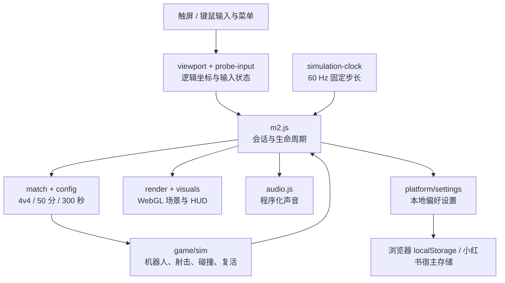
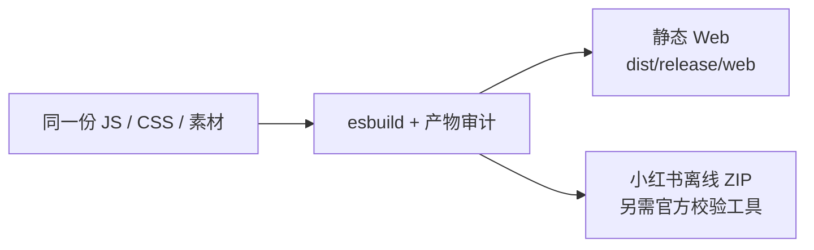

# 架构：一个本地对局，两种运行环境

MetaFight 没有游戏服务端。浏览器或小红书容器承担输入、固定步长模拟、绘制和声音；平台差异收敛在构建分支与设置存储中。

## 对局和时间

`config.js` 固定公众玩法，`match.js` 创建货轮地图和 8 人对局。`simulation-clock.js` 按 60 Hz 驱动模拟并限制单帧补算次数，渲染帧率不直接决定伤害或比赛时间。具体射击、碰撞、出生与导航复用并扩展上游 `src/game/`。机器人反应、连发与停顿参数在配置中可追溯。

## 输入和横屏

`probe-input.js` 名称来自早期验证阶段，当前继续负责多指分工、移动和瞄准状态。`viewport.js` 把屏幕输入映射为逻辑坐标。当宿主锁定竖屏时用 CSS 旋转内容，并对触控坐标做逆变换；不请求系统强制横屏或陀螺仪权限。

`m2.js` 统一处理开始、准备、暂停、复活、结算、重开和退出。后台、失焦和尺寸变化会暂停并清理输入，避免按键卡住或后台继续计时。

## 渲染和资源

`src/render/` 负责 WebGL；`visuals/` 提供货轮、人物和枪械。装饰外观与地图碰撞、出生点、导航分离。`runtime.js` 限制绘制尺寸并按帧耗时逐步降画质，不以减少参战人数降低负载。`dev/m3/assets/` 包含离线封面和材质图集，材质通过 HTML 声明的图片节点加载以适配宿主。

## 发布边界

构建使用 `__CHANNEL__` 隔离渠道、`__DEV_PROBE__` 移除开发诊断；公众包固定 4v4。网页版脚本与样式加内容散列，小红书包保留平台要求的静态入口。构建审计检查 ES2017、禁止 API、资源闭包、MIT 许可和开发入口泄漏。

仓库保留 `server/`、`src/net/` 与早期开发页面用于上游追溯和回归；它们不进入公众游戏构建，也不会被 `npm start` 启动。这里没有在线多人服务、账号服务或遥测后端。

## 测试范围与限制

`npm run verify` 运行地图、模拟、声音、输入适配、对局、画质预算、生命周期和发布裁剪检查。CI 的成功不等于所有手机的性能认证。小红书上线版本经过官方模拟器和用户试玩；更广泛的设备矩阵、长时温升和输入延迟仍需要实机记录。
